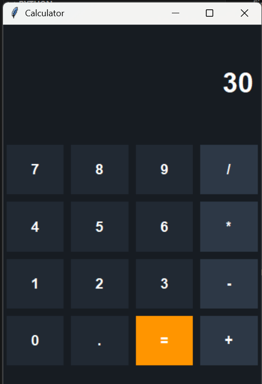

# 📱 Modern Dark-Themed Calculator



Python aur Tkinter library ka use karke banaya gaya ek stylish aur responsive desktop calculator. Isme sleek dark UI aur clean layout ka istemal kiya gaya hai.

---

### 🌟 Key Features (Khasiyat)
- 🎨 **Premium Dark UI:** Sleek aur modern aesthetic look ke liye cuslor palette ka use.
- 📐 **Responsive Grid:** Window choti-badi karne par saare buttons apne aap barabar set ho jaate hain.
- ⚡ **Flat Design:** Modern look dene ke liye buttons ke purane borders ko hataya gaya hai (`bd=0`).

### 🛠️ Tech Stack
- **Language:** Python 3
- **GUI Framework:** Tkinter

### 🚀 How to Run (Kaise chalayein)
1. Is repository se `calculator.py` file ko download karein.
2. Apne terminal ya VS Code me jaakar ye command chalayein:
   '''bash
   python calculator.py
   ---

### Step 2: Save Karein (Commit changes)
1. Paste karne ke baad, right side me upar green color ka button dikhega **`Commit changes...`**, uspar click kijiye.
2. Pop-up aane par fir se green button **`Commit changes`** daba dijiye.

Bas! Jaise hi aap ye karenge, aapka ye GitHub project ekdum chaka-chak aur complete ho jayega. Koi bhi aapki profile dekhega toh use maza aa jayega. Ek baar ye naya README add karke page ka look dekhiye!
3. Apne terminal ya VS Code me jaakar ye command chalayein:
   ```bash
   python calculator.py
